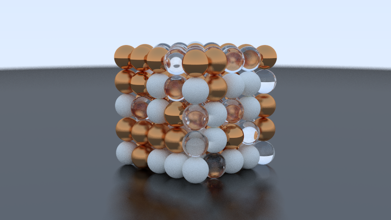

# raytrace

A C++20 implementation of a ray tracer based on Peter Shirley's *Ray Tracing in One Weekend*.

This project was built as an educational exercise to practice **modern C++ software design**. While the core rendering math follows the original text, the codebase has been restructured to emphasize separation of concerns, strict type safety, and parallel execution.



## Technical Overview

* **Redesigned Class Architecture:** Restructured the original class hierarchy to minimize mutable state and member variables.
* **Modern C++ Features:** Utilizes `std::shared_ptr` for automatic resource management and `std::optional` to explicitly handle intersection logic
* **Self-Contained Bitmap Writer:** Contains a custom implementation of the BMP Version 2 file format (`image.cpp`).
* **Parallel Execution:** Implements rendering loop using **OpenMP** to distribute the ray casting workload across available CPU cores.

## Build Instructions

The project requires a C++ compiler with **C++20** support and an **OpenMP** runtime.

### macOS (Clang)
macOS requires `libomp` for parallel execution.

1.  **Install dependencies:**
    ```bash
    brew install libomp
    ```

2.  **Compile:**
    ```bash
    mkdir build
    cd build
    cmake ..
    cmake --build .
    ```

3.  **Run:**
    ```bash
    ./raytrace
    ```

## References

* Shirley, P. (2020). [_Ray Tracing in One Weekend_](https://raytracing.github.io/books/RayTracingInOneWeekend.html).
* [BMP File Format Reference](https://www.fileformat.info/format/bmp/egff.htm)